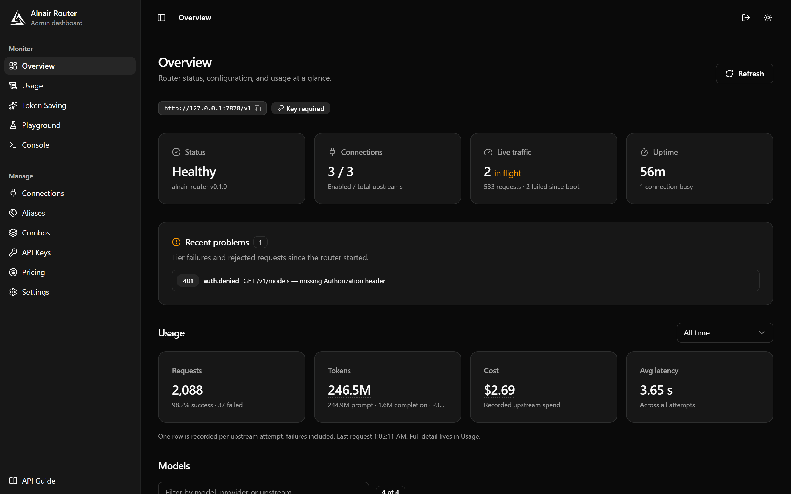
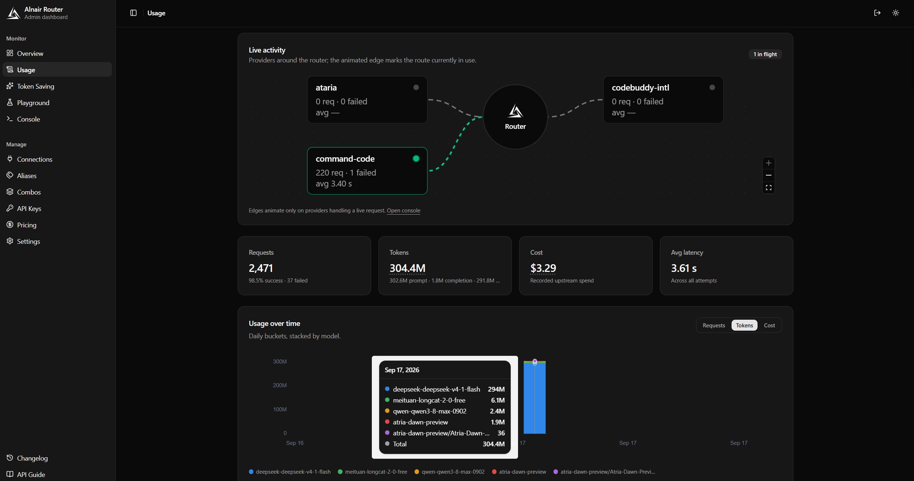
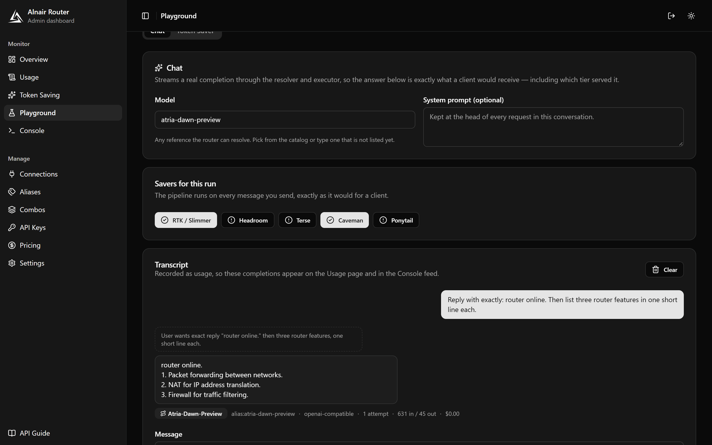
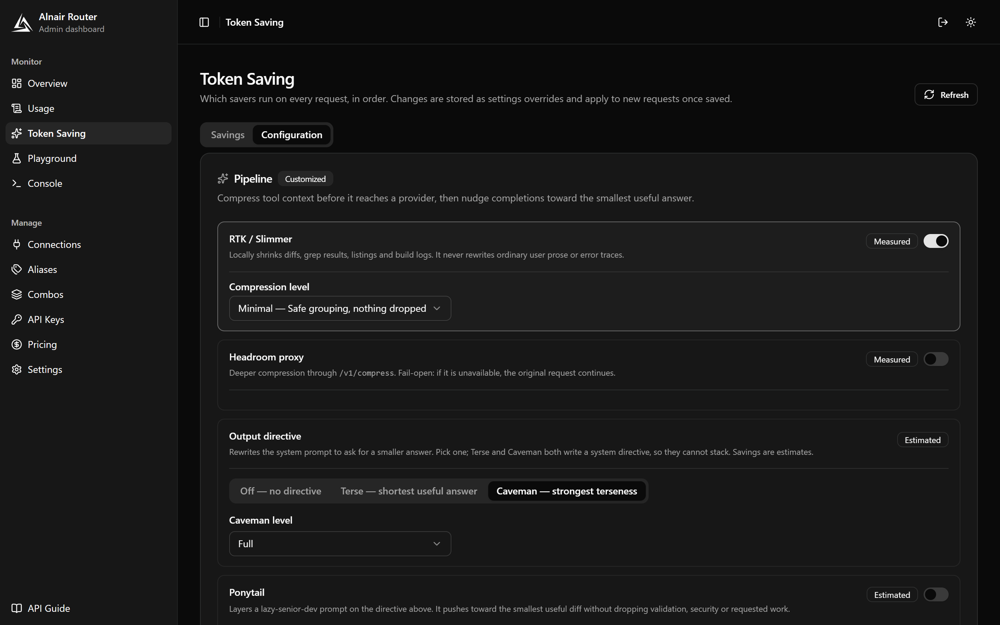
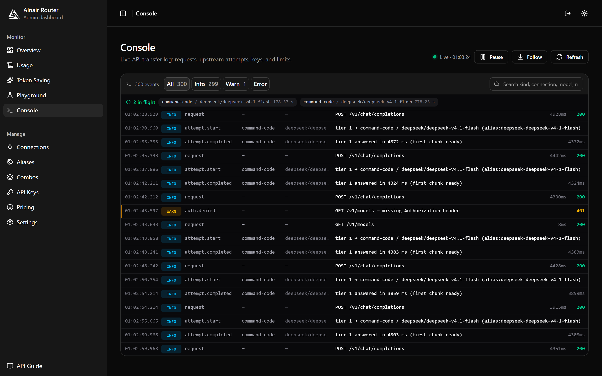
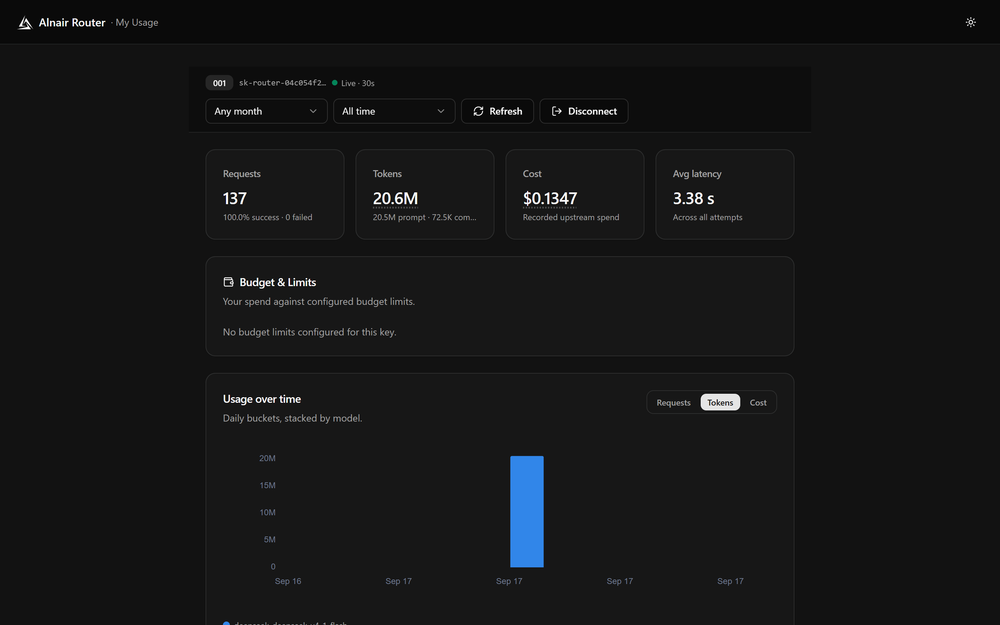

<div align="center">


# alnair-router

**One OpenAI-compatible endpoint in front of every model you use.** Prefixes
route to upstream connections, named combos expand into ordered fallback chains,
and every attempt is metered — with an embedded dashboard, no external database,
and a single Rust binary that stays lightweight and fast: a small footprint, low
latency, and no runtime to install.

[](https://github.com/xFlawlessDev/alnair-router/actions/workflows/ci.yml)
[](https://github.com/xFlawlessDev/alnair-router/actions/workflows/release.yml)
[](https://www.npmjs.com/package/@xflawlessdev/alnair-router)
[](https://github.com/xFlawlessDev/alnair-router/pkgs/container/alnair-router)
[](#license)

</div>

- **Model references** — `glm/glm-4.6`, a bare `gpt-4o`, or a combo name.
- **Fallback combos** — a tier that fails before emitting content moves to the next, transparently.
- **Aliases & connections** — one prefix per upstream, with round-robin API keys per connection.
- **Embedded dashboard** — connections, aliases, combos, catalog, keys, usage, settings, backup/restore.
- **Key controls** — rate limits, daily/weekly/monthly/lifetime budgets, model allowlists and plans.
- **Token saving** — a deterministic pipeline compresses bulky tool output and injects concise-output directives, with savings measured and priced per request.
- **Lightweight & fast** — one Rust binary, no runtime to install, low memory and low per-request overhead.
- **Both wire formats** — OpenAI (`/v1/chat/completions`, `/v1/responses`) and Anthropic (`/v1/messages`).

## Install

The binary doubles as its own installer: `install` creates a config with a
generated `secrets.key` and registers auto-start, so an installed router comes
back by itself after a reboot.

**Linux / macOS** — Linux x86_64 or Apple Silicon:

```bash
curl -fsSL https://raw.githubusercontent.com/xFlawlessDev/alnair-router/main/install.sh | sh
```

`install.sh` resolves the latest GitHub Release for your platform, verifies
`SHA256SUMS.txt`, installs to `~/.local/bin`, and runs `install`.

**Windows** — x64:

```powershell
irm https://raw.githubusercontent.com/xFlawlessDev/alnair-router/main/install.ps1 | iex
```

`install.ps1` verifies `SHA256SUMS.txt`, installs to
`%LOCALAPPDATA%\alnair-router\bin`, adds that to your user PATH, and runs
`install`. From a checkout it prefers a local `target\release` (or
`target\debug`) build.

**npm** — Node 18+:

```bash
npm install -g @xflawlessdev/alnair-router
# or run it without installing:
npx @xflawlessdev/alnair-router
```

The wrapper ships prebuilt binaries for Linux x64 (glibc), Windows x64, and
Apple Silicon through optional platform packages — no postinstall download,
nothing is fetched at runtime. Alpine/musl is not covered; use the install
script or build from source there.

**Docker:**

```bash
export ALNAIR_ROUTER__SECRETS__KEY="$(openssl rand -hex 32)"
docker compose up -d
docker compose logs         # copy the setup code, then open /login
```

Overrides: `ALNAIR_ROUTER_REPO`, `ALNAIR_ROUTER_VERSION`,
`ALNAIR_ROUTER_INSTALL_DIR`, and `ALNAIR_ROUTER_NO_AUTOSTART=1` on the shell
scripts (`-Version`, `-Repo`, `-InstallDir`, `-NoAutoStart` on PowerShell).

Manage it with:

```bash
alnair-router status      # running? auto-start state and paths
alnair-router start       # start it in the background
alnair-router stop        # stop it gracefully
alnair-router restart     # stop, then start again
alnair-router uninstall   # disable auto-start (config and data are kept)
```

Add `--port 9000` to `serve`/`start`/`restart` to listen somewhere else for that
run; the config file is not touched. `status` and `stop` need no `--port` — they
read the address the running router recorded (see
[Running in the background](#running-in-the-background)).

`install`/`uninstall`/`status` work on every platform (auto-launch writes a Run
key, LaunchAgent, or XDG autostart entry); the install scripts only place the
binary and delegate to `install`. `uninstall` keeps config and data by design.
To remove it completely: run `alnair-router uninstall`, then delete the install
dir (`%LOCALAPPDATA%\alnair-router` or `~/.local/bin/alnair-router`), the router
home (`~/.alnair-router`), and the PATH entry you added.

## What it does

Point any OpenAI-compatible client at the router and use a model reference:

| Reference | Resolves to |
|---|---|
| `glm/glm-4.6` | the `glm` alias → its connection, with model `glm-4.6` |
| `free-forever` | a combo → each entry in order, as fallback tiers |
| `gpt-4o` | the configured `default_connection` |

An alias that pins a model via its override can also be used as a bare model
name: with `kr → claude-4.5-sonnet`, `{"model": "kr"}` routes to that model
directly. Aliases without an override still need `prefix/model`.

When a tier fails **before any content is emitted**, the router transparently
moves to the next one. Responses report which tier answered via
`x-router-model`, `x-router-provider`, `x-router-attempt`, and
`x-router-source` headers.

## Quick start

No configuration is required: the router generates its encryption key at
`$ALNAIR_ROUTER_HOME/secrets.key` (default `~/.alnair-router/secrets.key`) on
first run and prints a dashboard setup code:

```bash
cargo run -p alnair-router
# alnair-router started in the background (pid 12345) at http://127.0.0.1:7878
#   log:  ~/.alnair-router/logs/router.log
#   stop: alnair-router stop
```

The router keeps running after the command returns, so the terminal is free and
closing it does not stop the router. Read the setup code at `/login` from the
dashboard itself, or from the log:

```bash
tail -f ~/.alnair-router/logs/router.log     # Get-Content -Wait on Windows
```

`alnair-router serve --foreground` (or `ALNAIR_ROUTER_FOREGROUND=1`) keeps the
old behaviour: it serves in the terminal, printing logs there, until Ctrl+C.
Launches with no terminal — auto-start, double-click, a container — also serve
in place, because there is nothing to detach from.

Open `http://127.0.0.1:7878/login`, paste the setup code and choose the
dashboard password. To override the generated key (or any other value), use
`config.toml` or env vars — e.g.
`ALNAIR_ROUTER__SECRETS__KEY="$(openssl rand -hex 32)"`.

The server listens on `127.0.0.1:7878`. Then configure an upstream and a
fallback chain (the admin API is open on loopback until a password is set):

```bash
# 1. An upstream endpoint
curl -X POST http://127.0.0.1:7878/api/connections \
  -H 'content-type: application/json' \
  -d '{
    "name": "openai-main",
    "provider_type": "openai-compatible",
    "base_url": "https://api.openai.com/v1",
    "api_key": "sk-..."
  }'

# 2. A prefix that maps to it
curl -X POST http://127.0.0.1:7878/api/aliases \
  -H 'content-type: application/json' \
  -d '{ "prefix": "oa", "connection_id": "<id-from-step-1>" }'

# 3. A fallback combo
curl -X POST http://127.0.0.1:7878/api/combos \
  -H 'content-type: application/json' \
  -d '{ "name": "free-forever", "entries": ["oa/gpt-4o-mini", "oa/gpt-4o"] }'
```

Now use it exactly like OpenAI:

```bash
curl http://127.0.0.1:7878/v1/chat/completions \
  -H 'content-type: application/json' \
  -d '{ "model": "free-forever", "messages": [{ "role": "user", "content": "hi" }] }'
```

## Repository layout

This repository is a standalone Cargo monorepo. A virtual workspace at the root
owns the lock file and build profiles; the router crate lives in
`crates/alnair-router/` and the provider stack in `crates/alnair-llm/`. It
depends only on crates.io — no path dependency outside the workspace — with its
own SQLite database and its own HTTP server.

```
.
├── Cargo.toml           # virtual workspace root
├── apps/
│   └── web/             # admin dashboard (Vue 3 + Vite)
├── crates/
│   ├── alnair-llm/      # provider stack (OpenAI-compatible + Anthropic-native)
│   └── alnair-router/   # the router crate (binary + library)
└── docs/                # HANDOVER.md, ROADMAP.md, screenshots/
```

## Built in Rust

The whole router is Rust — edition 2024, one workspace, one binary. No runtime,
no interpreter, no container needed: a compiled artifact with a small footprint,
fast startup and low per-request overhead, which is what makes the rest of this
README possible:

- **Tokio + Axum 0.8** — async streaming end to end, so SSE from an upstream is
  piped to the client without buffering the completion in memory.
- **SQLx + SQLite** — the database is a file, migrations are embedded with
  `sqlx::migrate!`, and queries are runtime SQL (no `DATABASE_URL`, no
  `cargo sqlx prepare` step). Nothing else to install or run.
- **rustls, no OpenSSL** — static builds with no system TLS dependency.
- **rust-embed** — the built Vue dashboard is compiled into the binary, so
  deploying one file deploys the API and the UI together.
- **aes-gcm + argon2** — upstream credentials encrypted at rest, dashboard
  passwords hashed properly.
- **`lto = "thin"`, `codegen-units = 1`, `strip = "symbols"`** — the release
  profile is tuned for a small, self-contained binary rather than fast rebuilds.

A Cargo workspace is the only build dependency: `cargo build --release -p
alnair-router` produces a binary that contains the router, the embedded
dashboard, and its own SQLite migrations. No Node, no Python, no external
database, no runtime package install.

## Admin dashboard

The Vue 3 dashboard in [`apps/web`](apps/web) manages everything the admin API
exposes — connections, aliases, combos, a model catalog with copyable ids and
prices, API keys, usage, runtime settings, and database backup/restore — and the
built assets are **embedded into the router binary**: with a production build,
open `http://127.0.0.1:7878/` and the dashboard is there. Set
`server.serve_dashboard = false` when a reverse proxy serves it instead.

Screenshots of every page, captured from a live router, live in
[`docs/screenshots`](docs/screenshots) — see its
[README](docs/screenshots/README.md) for the full index.

| | | |
|---|---|---|
| [](docs/screenshots/02-overview.png) <br> **Overview** — status, usage rollup, catalog | [](docs/screenshots/12-usage.png) <br> **Usage** — live topology, trend chart, filters | [](docs/screenshots/10-playground-chat.png) <br> **Playground** — streamed chat, tier badge |
| [](docs/screenshots/09-token-saving-config.png) <br> **Token saving** — pipeline controls, levels | [](docs/screenshots/13-console.png) <br> **Console** — live API transcript log | [](docs/screenshots/16-my-usage.png) <br> **My Usage** — client-key self-service rollup |

For development, run it with Vite against the live router:

```bash
cd apps/web
pnpm install
pnpm dev           # http://localhost:5173, proxies /api and /v1 to :7878
```

Set `ALNAIR_ROUTER_URL` to point the dev proxy at a different router. See
[`apps/web/README.md`](apps/web/README.md).

### System tray

On Windows and macOS `alnair-router` runs with a tray icon: **Open dashboard**
and **Quit** (graceful shutdown), and on Windows left-click opens the dashboard
directly. Disable it with `--no-tray` or `server.tray = false`; Linux always
serves headless. The icon also appears for a background run, so the tray is how
you stop the router when you have no terminal in front of you.

Windows builds are GUI-subsystem binaries, so no console window appears on
auto-start or double-click. Run the binary from a terminal and CLI output plus
logs attach to that terminal as usual; a background run logs to
`$ALNAIR_ROUTER_HOME/logs/router.log` instead.

### Running in the background

`serve` detaches when it is launched from a terminal, so the shell prompt comes
back as soon as the router is listening. Everything the background run needs
lives in `$ALNAIR_ROUTER_HOME`:

| File | Purpose |
|---|---|
| `router.pid` | PID of the serving process and the `host:port` it listens on |
| `logs/router.log` | Appended stdout/stderr, rotated to `router.log.1` past ~5 MB |
| `control.token` | 32-byte secret the CLI uses to request a graceful stop |

`stop` posts to `POST /api/admin/control/shutdown` with that token and waits for
the process to exit, so the router shuts down through the same graceful path as
the tray's **Quit**. It falls back to `SIGTERM` where the platform has it, and
`stop --force` is there for a process that will not stop. The route is guarded
by the control token alone — not `server.admin_token` and not the dashboard
password — so it keeps working before either of those is configured; a web page
cannot read the token file, so a browser cannot forge the request.

Because the address lives in `router.pid`, `status` and `stop` find the router
however its port was chosen: `config.toml`, `ALNAIR_ROUTER__SERVER__PORT`, or a
`--port` flag the config never saw.

Use `--detach` to force a background start where the terminal cannot be
detected (for example from a script), and `--foreground` for the opposite.

## Docker

Every `v*` tag publishes an image to GHCR (`ghcr.io/xflawlessdev/alnair-router`).
`docker-compose.yml` pulls the latest release and runs it as a non-root user
with `/data` as the state volume:

```bash
export ALNAIR_ROUTER__SECRETS__KEY="$(openssl rand -hex 32)"
docker compose up -d
docker compose logs         # copy the setup code, then open /login
docker compose pull         # pick up a newer release
```

The compose file enables LAN access inside the container (a published port
cannot reach a loopback bind) and keeps `/v1` closed to anyone without a key.
The first time, `docker compose logs` prints `alnair-router setup code: …`; use
it at `/login` to create the dashboard password. See
[Exposing beyond loopback](#exposing-beyond-loopback).

The image sets `ALNAIR_ROUTER_FOREGROUND=1`: a container runs the router as PID
1 with no terminal, and PID 1 must not detach, or the container would exit the
moment it started. Any supervisor that wants the process to stay in the
foreground should set the same variable (or pass `serve --foreground`).

Pin a version with `image: ghcr.io/xflawlessdev/alnair-router:vX.Y.Z`, or build
from source instead with `docker build -t alnair-router .`.

The GHCR package starts private; make it public in the repository's package
settings for anonymous pulls.

## Exposing beyond loopback

The dashboard is protected by a **password** (no username). First-run flow:

1. Start the router; when no password exists the log prints a one-time code:
   `alnair-router setup code: 8f3a-2b91-c4d7-e5f6`.
2. Open `/login`, paste the code and choose a password (8+ characters). Sessions
   use rotating access/refresh tokens stored hashed in SQLite; replaying a
   rotated refresh token revokes that whole session family.
3. In **Settings → Security**, turn on **LAN access**. The listener re-binds to
   every interface immediately and admin routes start requiring sign-in. The
   login page and `/api/auth/status` stay reachable so other devices can sign
   in once someone enables it.

`/v1` is separate: it takes router-issued client keys. Set
`server.require_api_key = true` (Settings or config) before exposing the
network, or anyone who can reach the port can spend upstream credits. Keys are
minted on the API Keys page (hashed for lookup, with an encrypted copy kept so
the dashboard can reveal them, revocable, rate limits and budgets per key).

Deployment notes:

- `server.admin_token` still works for scripts and CI; when set it is accepted
  alongside password sessions. `server.allow_unauthenticated_admin` opts out of
  both (trusted networks only).
- TLS: the router speaks HTTP only. Terminate TLS in front of it — Caddy or
  nginx on the same host (`reverse_proxy 127.0.0.1:7878`, keeping the router on
  loopback), a Cloudflare tunnel
  (`cloudflared tunnel --url http://127.0.0.1:7878`), or Tailscale/WireGuard for
  private access.
- `server.cors_origins` gates browser cross-origin calls: empty (default) emits
  no CORS headers, `["*"]` allows any origin, otherwise an explicit allowlist.
  It can be edited on the Settings page without a restart. Non-browser clients
  are unaffected.
- `/api/health` and `/api/ready` stay public and carry no secrets.
- `server.public_usage` (default true) exposes `/me` and `/api/public/*`, which
  still require a valid client key; turn it off if clients should not
  self-serve.
- `server.host`/`server.port`, `server.serve_dashboard` and `secrets.key` remain
  file/env values that need a restart.

Behind a same-host proxy the router can keep `host = "127.0.0.1"`, so only the
proxy is reachable from the network. In Docker, publish the port explicitly
(`-p 127.0.0.1:7878:7878` for a host proxy, `-p 7878:7878` for LAN) and set
`ALNAIR_ROUTER__SERVER__HOST=0.0.0.0` inside the container.

## Endpoints

**OpenAI-compatible:**

| Endpoint | Notes |
|---|---|
| `POST /v1/chat/completions` | Core. Streaming (SSE) and non-streaming. |
| `POST /v1/responses` | OpenAI Responses shape. Streaming (SSE `response.*` events) and non-streaming; accepts `tools`/`tool_choice` (`auto` or `none`). |
| `GET /v1/models` | Lists configured aliases and combos. |
| `GET /v1/models/{id}` | One model object; 404 for an unknown alias or combo. |
| `GET /v1/models/info` | Per-reference metadata, including resolved combo tiers. |
| `POST /v1/embeddings` | Proxied to the resolved connection. |
| `POST /v1/images/generations`, `/v1/images/edits`, `/v1/images/variations` | Proxied; edits and variations are multipart pass-through. |
| `POST /v1/moderations` | Proxied. |
| `POST /v1/audio/speech`, `/v1/audio/transcriptions`, `/v1/audio/translations` | Proxied (multipart pass-through for transcriptions/translations). |
| `POST /v1/videos/generations`, `GET /v1/videos/{id}` | Proxied, including async job polling. The polling URL takes `?model=` to name the connection. |
| `POST /v1/search`, `POST /v1/web/fetch` | Proxied / server-side fetch (SSRF-guarded — see below). `search` takes an optional `model` to pick the connection. |

Every proxied endpoint accepts a `model` reference (alias, `alias/model`, combo
name, or bare model name). The connection's real model id is written into the
upstream request in its place; `/v1/search`, whose upstream takes no model,
has the field removed instead. Calls are recorded in usage like chat requests,
so a proxied request still shows up against its key and connection.

> **`/v1/web/fetch` caveat.** Unlike the other proxied endpoints it fetches an
> arbitrary URL server-side rather than through a configured connection, so its
> SSRF guard is the only thing standing between it and your internal network.
> The guard allows only `http`/`https`, rejects loopback, RFC-1918, link-local,
> unique-local, unspecified and broadcast addresses (including IPv4-mapped IPv6
> forms), resolves hostnames up front and pins the connection to the validated
> IPs, then re-validates every hop through up to 5 redirects. Treat it as an
> internet fetch only — keep it off networks where private addresses still
> resolve to something sensitive.

**Anthropic-compatible:**

| Endpoint | Notes |
|---|---|
| `POST /v1/messages` | Translates to the shared executor; streams with proper Anthropic event ordering. |
| `POST /v1/messages/count_tokens` | Heuristic estimate (no tokenizer dependency). |

**Probes (always public):** `GET /api/health` (liveness, no database touch) and
`GET /api/ready` (checks the database). They stay unauthenticated so container
and load-balancer healthchecks need no bearer token.

**Auth:** `GET /api/auth/status`, `POST /api/auth/setup`, `POST /api/auth/login`
and `POST /api/auth/refresh` are public; `POST /api/auth/logout` and
`PATCH /api/auth/password` need a session. The dashboard signs in with a
password only (no username) and rotates access/refresh tokens server-side.

**Admin** — everything below is open on loopback and, when `server.admin_token`
is set, requires `Authorization: Bearer <token>`:

| Group | Routes |
|---|---|
| Meta | `/api/version`, `/api/init`, `/api/providers` (built-in endpoint presets), `/api/metrics` (Prometheus counters), `/api/activity` (in-memory live feed: in-flight attempts, per-connection counters, recent events) |
| Connections | `/api/connections`, `/api/connections/{id}`, `/{id}/models` (what the upstream offers), `/{id}/test` (connectivity), `/{id}/accounts` (extra API keys) |
| Aliases | `/api/aliases`, `/api/aliases/{id}`, `/{id}/test` (connection + model override), `/{id}/test-chat` (one real completion through the alias) |
| Combos | `/api/combos`, `/api/combos/{id}` |
| Keys | `/api/keys`, `/api/keys/{id}`, `/{id}/secret` (reveal), `/{id}/rotate` |
| Plans | `/api/plans`, `/api/plans/{id}` |
| Usage | `/api/usage`, `/api/usage/summary`, `/api/usage/facets`, `/api/usage/models` (per-model rollup), `/api/usage/timeseries` (time-bucketed per model, for the trend chart), `/api/usage/keys` (spend per key, split by budget window) |
| Catalog & pricing | `/api/models` (provider + model + price catalog), `/api/pricing` (GET/PUT/DELETE), `/api/pricing/sync` (GET status / POST run), `/api/pricing/match?model=…` |
| Token saver | `/api/token-saver/playground`, `/api/token-saver/headroom/test` |
| Playground | `/api/playground/chat` (admin-guarded SSE: streams a real completion, reports tier + savings) |
| Settings & data | `/api/settings`, `/api/backup`, `/api/restore` |
| Process control | `/api/admin/control/shutdown` — graceful stop for the CLI. Guarded by the local `control.token` instead of the admin credential, so `alnair-router stop` works before a password or admin token exists. |

`/api/connections/{id}/accounts` manages extra API keys for one connection: the
primary key and enabled accounts rotate round-robin per request, and a failing
key falls through to the next before the tier is abandoned.
`PATCH /api/keys/{id}` edits a key's name, enabled state, rate limit,
daily/weekly/monthly/lifetime budgets, model allowlist, plan and expiry;
`/api/plans` manages the reusable rule sets.

Usage reads accept `api_key_id`, `model` (case-insensitive substring),
`provider` (the wire protocol: `openai-compatible` / `anthropic-native`),
`connection` (the upstream that served the attempt), `since`/`until` (ISO-8601,
inclusive), and — on `/api/usage` — `sort` and `order` to order the table by
`time`, `model`, `connection`, `status`, `tokens`, `cost` or `latency`.
`/api/usage/timeseries` additionally takes `bucket=hour|day`, and
`/api/usage/facets` lists the distinct models, providers and connections the
dashboard offers as filter options. Usage rows keep prompt, completion, cached
and reasoning tokens plus input, output and reasoning cost components, shown in
the dashboard as breakdown popovers.

Pricing rate lookups strip a `vendor/` prefix and fall back to a connection's
`pricing_model` when the upstream id is a relay path;
`GET /api/pricing/match?model=…` reports which catalog key answers an id.

**Public (client key):** `GET /api/public/usage` and `GET /api/public/models` —
outside the admin-token guard. The caller authenticates with a router-issued
key (`Authorization: Bearer sk-router-…`). Usage returns only its own rollup:
the summary, a per-model breakdown and a per-(bucket, model) time series
(`?bucket=hour|day`, default `day`, plus optional `since`/`until`). Models
returns the catalog rows the key's allowlist (key or plan) can reach, with
rates, and the page shows the OpenAI-compatible `/v1` base URL above the table
for easy copying. They back the self-service page at `/me`, which stacks models
in one bar chart, offers quick ranges and a month selector, and refreshes every
30 seconds. Disabled with `server.public_usage = false`.

> Admin routes are open on loopback by default, because they mint the keys that
> authenticate `/v1/*`. Set `server.admin_token` to require
> `Authorization: Bearer <token>` on every `/api/*` request — this is enforced
> whenever the token is configured. A non-loopback bind refuses to start
> without one unless `server.allow_unauthenticated_admin = true` is set
> explicitly.

## Configuration

Reads `$ALNAIR_ROUTER_HOME/config.toml` (default `~/.alnair-router/config.toml`),
overridable by `ALNAIR_ROUTER__SECTION__KEY` env vars — e.g.
`ALNAIR_ROUTER__SERVER__PORT=9000`.

Key settings:

- `secrets.key` — AES-256-GCM key for upstream credentials at rest. Optional:
  when unset the router generates `$ALNAIR_ROUTER_HOME/secrets.key` on first
  run and reuses it. Legacy plaintext rows are re-encrypted on boot.
- `server.store_key_secrets` (default `true`) — keep a reversible copy of every
  router-issued client key so the dashboard can reveal it. Off means a key is
  readable only at creation time, for when you would rather the router not hold
  client keys in recoverable form. It guards `secrets.key` too, so back that up
  alongside the database.
- `server.admin_token` — optional bearer token for scripts and CI. The
  dashboard itself signs in with a password (see
  [Exposing beyond loopback](#exposing-beyond-loopback)).
- `router.max_retries_per_tier` (default 2) and `router.max_retry_delay_ms`
  (default 30000) — provider retries inside one tier before failover, with
  exponential backoff.
- `limits.max_concurrent` / `limits.max_concurrent_per_connection` — upstream
  concurrency caps; a request that cannot get a slot in time gets `429` with
  `Retry-After`.
- `rate_limit.requests_per_minute` — default per-key token bucket (0 = off);
  keys can override it, and can carry daily, weekly, monthly and lifetime
  budgets in USD and token limits (calendar windows, UTC; lifetime never
  resets) with `off`/`warn`/`block` enforcement. Token limits count prompt +
  completion tokens.
- Key **rules** — each key can restrict the models it may call (exact names or
  `openai/*` / `*` wildcards, enforced with `403` on every `/v1` endpoint that
  carries a model). A key's own rules win over its plan; bundle an allowlist,
  rate limit and budget into a reusable **plan** and apply it to any key from
  the dashboard's API Keys page (`/api/plans`), whose allowlist editor searches
  the available aliases and combos. Keys and plans can also carry an
  `expires_at`: an expired key is rejected with `401`, and keys on an expired
  plan fail closed with `403` until the plan is extended.
- `router.catalog_ttl_ms` (default 1000) — routing-catalog cache; admin writes
  invalidate it immediately.
- `router.connect_timeout_ms` / `router.idle_timeout_ms` — default upstream
  first-byte and stream-idle timeouts; each connection can override or disable
  them (`0`).
- `server.readiness_upstream_checks` — makes `/api/ready` report TCP
  reachability counts for enabled connections.
- `server.public_usage` (default true) — exposes the self-service page at `/me`
  and `GET /api/public/usage`, where a client reads its own rollup (summary
  plus per-model totals) with a router-issued API key.
- `server.lan_access` (default false) — bind every interface so the LAN can
  reach the router; flippable from Settings and the listener re-binds without a
  restart. Admin routes then require the dashboard password.
- `server.cors_origins` — browser cross-origin allowlist (editable on the
  Settings page); empty (default) emits no CORS headers at all, `["*"]` allows
  any origin, otherwise only the listed origins are answered.
- `server.tray` (default true) — system tray icon with **Open dashboard** and
  **Quit** on Windows and macOS; `alnair-router --no-tray` disables it for one
  run.
- `pricing.sync_enabled` (default false) + `pricing.sync_interval_secs`
  (86400) — crawl `pricing.source_url` (LiteLLM or models.dev payload) for
  model rates. Dashboard overrides win over crawled rows, which in turn shadow
  the built-in rate table.
- `token_saver.*` — the deterministic token-saving pipeline that runs on every
  chat request before provider translation (full behaviour under
  [Token saving](#token-saving)):
  - `slimmer_enabled` (default true) compresses bulky tool output locally.
  - `headroom_enabled` (false) routes messages through an external Headroom
    proxy at `headroom_url` (`http://localhost:8787`), failing open when the
    proxy is unreachable.
  - `terse_enabled` / `caveman_enabled` (both false) inject a concise-output
    directive and are **mutually exclusive** — the router refuses to start with
    both set. `ponytail_enabled` (false) stacks a "lazy senior dev" directive on
    top of either.
  - Levels: `slimmer_level` (`minimal`/`aggressive`), `caveman_level`
    (`lite`/`full`/`ultra` plus the `wenyan-*` variants) and `ponytail_level`
    (`lite`/`full`/`ultra`). An unknown level or a malformed `headroom_url`
    fails at startup rather than silently falling back.
- `update.check_enabled` (default true) — let the dashboard ask GitHub for the
  newest release so the Overview and Changelog pages can flag an available
  update. `update.repo` sets the `owner/name` slug, `update.api_url` the
  releases API base (a mirror or GitHub Enterprise host), `update.cache_ttl_secs`
  (3600) how long a lookup is reused, and `update.include_prereleases` (false)
  whether pre-releases count as newer. Set `check_enabled = false` for a fully
  offline router; the dashboard then shows the running version only.

A subset of the settings above — client/admin auth, routing, limits, rate limits
and pricing — can be edited from the dashboard's **Settings** page. Overrides
live in the router database, apply immediately without a restart, and take
precedence over `config.toml`/env until you reset them. The **Token Saving** page
owns the `token_saver.*` controls on its **Configuration** tab, and its
**Savings** tab reports what the pipeline clawed back, split into measured input
savings (RTK, Headroom) and estimated output savings (the directives), because a
terser answer cannot be measured after the fact. Both pages write the same
override store.

The **Playground** (`/playground`) is the hub for exercising the router by hand,
with two tabs. **Token Saver** (`POST /api/token-saver/playground`) runs the
pipeline on a sample request and shows each step's effect on the prompt; it calls
the same code path live traffic does, so what it reports is what happens to a
real request. Token counts are measured from the rewritten messages rather than
taken from each saver's own figure, and a step that declines is listed with
unchanged counts. Give it a model and an assumed completion length to price the
output directives; leave the length empty and no output estimate is reported.

**Chat** (`POST /api/playground/chat`) streams a multi-turn completion through
the same resolver, executor and pipeline, and reports the tier that answered,
the token/cost totals, and what the pipeline removed from the prompt. It is
admin-guarded rather than key-guarded, so it keeps working with
`server.require_api_key` on and needs no pasted router key. Per-run saver
overrides are shared by both tabs and validated exactly like the Configuration
tab on the Token Saving page, so you can compare configurations without saving
them. The old `/token-saver/playground` URL redirects here.

The same page backs up and restores data: **Download backup** streams a
consistent SQLite snapshot (`GET /api/backup`) and **Import backup** replaces
every data table inside one transaction (`POST /api/restore`). Imports validate
the file and its credentials, and leave runtime settings and the admin token
untouched.

See `crates/alnair-router/router.example.toml` for every option.

## Token saving

A deterministic pipeline runs on **every chat request** before provider
translation, so the savings are identical whichever upstream tier ends up
answering. Two guarantees hold for every step: it is **deterministic** (no
randomness, clocks or per-request state — same input and settings always give
the same output) and it **fails open** (a saver that cannot do its job returns
its input untouched; nothing here can fail a request). The order is fixed:
`slimmer → headroom → terse/caveman → ponytail`.

Savers split into two kinds, and the dashboard is explicit about which is which.
**Input** savers shrink the prompt, so their numbers are *measured* from the
rewritten messages. **Output** savers only inject a system directive and let the
model write less — a shorter answer cannot be measured after the fact, so their
numbers are *estimates* and are labelled as such rather than presented as
measurements.

| Saver | Side | Default | What it does |
|---|---|---|---|
| **Slimmer (RTK)** | input — measured | **on** | compresses bulky tool output locally |
| **Headroom** | input — measured | off | deeper compression via an external proxy |
| **Terse** | output — estimated | off | concise-output directive |
| **Caveman** | output — estimated | off | stronger terseness directive |
| **Ponytail** | output — estimated | off | "lazy senior dev" directive; stacks on terse *or* caveman |

### Slimmer (RTK)

Only messages with `role == "tool"` are touched — tool results (diffs, greps,
file listings, build logs) are routinely 30–50% of a prompt and almost all of
the bulk is noise the model does not need. A detector reads the opening
kilobyte to decide what a blob is, then applies the matching filter. Two levels:

- `minimal` (default) — lossless filters only: grouping and de-duplication, no
  line dropping.
- `aggressive` — every filter, including the lossy head/tail truncation and log
  de-duplication.

Safety rules, all enforced:

- **Never worse** — a filtered result that is empty or not smaller than the
  input is discarded in favour of the original.
- **Never fatal** — each filter is wrapped so a panic passes the input through
  untouched instead of taking the request down.
- **Error traces stay verbatim** — a blob whose first non-blank line opens with
  `Error`, `error:`, `error[`, `Traceback (most recent call last)`, `panic:`,
  `fatal:` or `FATAL` is left alone; a truncated stack trace is worse than a long
  one.
- Multipart tool results (carrying images) are never flattened, and blobs under
  500 characters or over 10 MiB are skipped — below the floor the filter costs
  more than it saves, above the ceiling scanning costs more than it saves.

### Headroom

An optional, separate open-source compression proxy. The router posts its
messages to the proxy's `POST /v1/compress` and uses whatever comes back;
routing, auth, fallback and usage tracking are unchanged. The router
deliberately does **not** take the proxy's word for it:

- A `200` is not proof of compression — Headroom answers `200` with the original
  messages plus `compression_skipped: true` when it times out internally.
- **Phantom savings are rejected**: a shrink under 5% is treated as noise, not a
  result.
- Stricter than the reference implementation — instead of running a normalizer to
  repair `tool_call`/`tool_result` pairs after compression, any result that
  changes the conversation's shape is rejected outright.
- Down, slow or confused → the request passes through untouched and the reason
  is recorded in the request's notes.

> **Deployment gotcha.** `/v1/compress` is **loopback-only** on the proxy side
> and answers non-loopback callers with `404` on purpose. Both the client IP and
> the inbound `Host` header must name loopback, so a container or remote URL will
> not work without `HEADROOM_COMPRESS_ALLOW_REMOTE=1` set on the proxy.
> `POST /api/token-saver/headroom/test` probes it and reports version + latency.

### Output directives

These change no message content — they add one instruction block to the system
prompt and let the model do the rest. The directive text is adapted from
KeiRouter's Go implementation and kept **verbatim**: the wording is the feature,
and paraphrasing it changes model behaviour.

**Terse and caveman are mutually exclusive** — both write a system directive, so
the router refuses to start with both set. **Ponytail stacks on top of either.**
Terse has a single intensity; caveman and ponytail each take a level. The three
`wenyan-*` caveman levels answer in classical Chinese.

| Level | Caveman | Ponytail |
|---|---|---|
| `lite` | ~40% | build what's asked, name the lazier alternative in one line |
| `full` (caveman default) | ~60% | the ladder enforced; stdlib and native first; shortest diff |
| `ultra` | ~70% | YAGNI extremist; deletion before addition |
| `wenyan-lite` | ~50% | — |
| `wenyan-full` | ~70% | — |
| `wenyan-ultra` | ~75% | — |

Terse is always ~40%. The percentages are the *expected* completion reduction,
deliberately conservative — the published "up to 65–75%" figures are a ceiling,
not a mean.

An unknown level or a malformed `headroom_url` **fails at startup** rather than
silently falling back, because a misspelled level would otherwise change model
behaviour with no signal. The playground's per-run overrides go through the same
validation, so a playground run can never accept settings the real request path
would refuse.

### How savings are counted

- **Input is measured, output is estimated.** Slimmer and Headroom figures come
  from re-estimating the rewritten messages (roughly 4 characters per token), not
  from each saver's own reported count — so any disagreement stays visible.
- **Stacked output savers split the remainder, not the original.** Caveman (60%)
  on a 100-token completion leaves 40; ponytail (25%) then takes 10 of *those*,
  not 25 of the original.
- **Directives report the tokens they cost.** Injecting a directive makes the
  prompt slightly longer; the honest trade is a few prompt tokens buying a much
  shorter completion, which is priced once the model answers.
- Once the provider reports its completion token count, the winning tier's
  catalog rate is applied to both sides to give a `saved_cost_usd` figure. The
  per-saver token columns, the cost, the Prometheus counters and the activity
  feed line (e.g. `1234 prompt, 567 output (est.)`) all come from that one
  calculation.

## Provider support

| `provider_type` | Status |
|---|---|
| `openai-compatible` | Supported |
| `anthropic-native` | Supported |
| `command-code` | Supported — Command Code's Provider API, falling back to its CLI transport when the plan has no API access (Go) |
| `codebuddy-intl` | Supported — CodeBuddy Intl stream-only API at `https://www.codebuddy.ai/v2`; the router transforms messages and always streams upstream |
| anything else (including `ollama`) | **Rejected at write time** with `400 unsupported_provider_type` |

## Architecture

```
crates/alnair-router/src/
├── crypto.rs            # AES-256-GCM credential encryption at rest
├── desktop/             # system tray (Windows/macOS): event loop, menu, icon
├── model/cache.rs       # cached routing catalog (TTL + invalidation)
├── model/resolver.rs    # pure resolution: reference → ordered targets
├── upstream/
│   ├── chat_backend.rs  # ← the ONLY file that may touch `alnair_llm`
│   ├── executor.rs      # fallback walk, permits, timeouts, first-chunk peek
│   └── media.rs         # HTTP proxying for non-chat endpoints
├── protocol/            # OpenAI ⇄ Anthropic wire translation
├── handlers/            # HTTP handlers + embedded dashboard serving
├── db/repos/            # SQLite repositories
└── server.rs            # route table
```

### Standalone by design

The workspace builds with **no path dependency on anything outside this
repository** — `Cargo.lock` resolves entirely from crates.io. The provider stack
(OpenAI-compatible, Anthropic-native, Command Code and CodeBuddy Intl) lives in `crates/alnair-llm`, with the
Ollama provider and the RAG/queue/handler layers removed.

Every coupling point to that crate is funnelled through the single module
`src/upstream/chat_backend.rs`; no other file names `alnair_llm`. A test enforces
this:

```bash
cargo test -p alnair-router vendored_llm_layer_is_imported_from_exactly_one_file
```

That keeps the provider layer swappable: replacing it is a one-file change plus
a single `Cargo.toml` line.

## Development

Building the router needs a Rust toolchain new enough for **edition 2024** and
the locked `icu_*` dependencies (1.88 or newer) and, for a dashboard-included
build, pnpm for `apps/web`. There is no `DATABASE_URL` to set and no
`cargo sqlx prepare` step — queries run against the SQLite file at runtime, so
`cargo build` is enough.

```bash
# Router
cargo check --workspace
cargo test --workspace

# Dashboard
cd apps/web
pnpm run check     # vue-tsc + production build
pnpm test
```

The Rust suite covers pure resolution, repository behaviour against a real
in-memory SQLite, fallback ordering against an in-process mock upstream, and
endpoint shape/auth over the real Axum app. The web suite covers the API client,
formatters, and routing.

A local run backgrounds itself when it has a terminal, so use
`cargo run -p alnair-router -- serve --foreground` to watch logs inline;
`tests/cli_lifecycle.rs` drives the real binary for the start/stop contract.

Opt-in tests against real providers live in `tests/e2e_real.rs` and are
`#[ignore]`d:

```bash
ALNAIR_ROUTER_E2E_OPENAI_API_KEY=sk-... \
  cargo test -p alnair-router --test e2e_real -- --ignored
```

## Documentation

- [`docs/HANDOVER.md`](docs/HANDOVER.md) — architecture, design decisions, how to run it
- [`docs/ROADMAP.md`](docs/ROADMAP.md) — what is done, what is missing, what is unsafe
- [`docs/screenshots/`](docs/screenshots) — dashboard screenshots of every page, plus an index

## Releasing

Versioning is driven by [standard-version](https://github.com/conventional-changelog/standard-version)
from conventional commits (root tooling only — the shipped artifact is the Rust
binary):

```bash
npm install            # root release tooling
npm run release:dry    # preview the bump and changelog
npm run release        # bump, changelog, sync manifests, commit, tag
git push --follow-tags origin main
```

`scripts/sync-version.mjs` (the `postbump` hook) keeps `crates/*/Cargo.toml`,
`apps/web/package.json`, the `npm/*/package.json` manifests (including the
platform `optionalDependencies`), and `Cargo.lock` in lockstep and stages them
so the release commit carries every manifest.

Pushing a `v*` tag runs `.github/workflows/release.yml`: it builds the dashboard
and the router for Linux x86_64, Windows x86_64, and macOS arm64, packages each
target (`tar.gz`/`zip`), and attaches the archives plus `SHA256SUMS.txt` to the
GitHub Release for the tag. The same run publishes the container image to GHCR
and the npm wrapper (`@xflawlessdev/alnair-router` plus one binary package per
platform) with provenance; the npm job needs an `NPM_TOKEN` repository secret
with publish rights to the `@xflawlessdev` scope.

For a local release binary with the embedded dashboard:

```bash
npm run build:binary   # pnpm -C apps/web run build && cargo build --release --locked -p alnair-router
```

## License

[MIT](LICENSE). The dashboard under `apps/web` is scaffolded from the EvoFast
`vue-tailwind-vite` template, also MIT.
